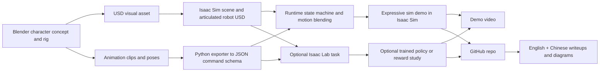
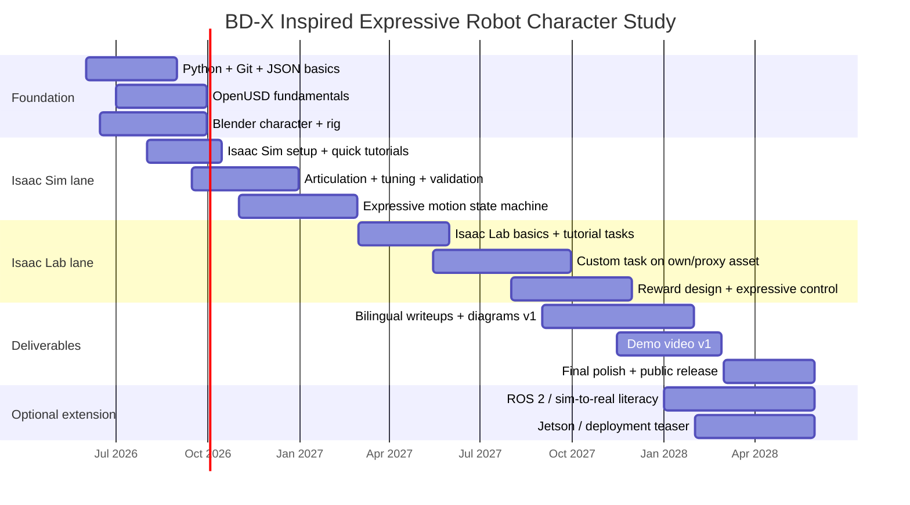

# BD-X Inspired Expressive Robot Character Study Learning Plan

## Executive summary

Your goal is ambitious but realistic **if you scope it as a character-study portfolio project first, not as a full Disney-class hardware reproduction**. The BD-X paper’s most important lessons are not “copy this robot exactly,” but rather: combine **artist-directed motion**, **low-dimensional runtime commands**, an **animation engine that blends motion layers**, and **robust physically grounded control**. Disney’s published system uses reinforcement-learning policies conditioned on command signals, with runtime commands generated by an animation engine that blends background, triggered, and operator-driven motion layers; the robot itself uses **5 DoF per leg** and a **4 DoF neck/head assembly**. That is the right conceptual target for your study. citeturn8search1turn30view0turn30view2turn30view4

The most important strategic decision for 2026 is to build on the **stable NVIDIA stack**, not the newest bleeding edge. As of late May 2026, Isaac Sim 6.0 documentation is still marked **Early Developer Release** with GA artifacts pending, while Isaac Lab’s installation guide explicitly recommends the **latest Isaac Sim 5.1.0 release** for most users and beginners. Isaac Lab also documents Newton integration under **experimental features**, and NVIDIA’s Newton pages position it as an important future direction rather than the safest first-year dependency for a solo learner. So your core lane should be: **Blender LTS + OpenUSD basics + Isaac Sim 5.1 + stable Isaac Lab release aligned to 5.1**, and only then optional Newton experiments later. citeturn40view0turn13view0turn29view0turn28view0

A second crucial decision: **do not buy Jetson first** expecting it to replace your main Isaac workstation. NVIDIA’s current Isaac Sim requirements page lists x86_64 minimums around a **GeForce RTX 4080 with 16 GB VRAM**, and its aarch64 Isaac Sim support currently points to **DGX Spark**, not Jetson. Jetson Orin Nano Super is excellent as an **optional later deployment/edge target** and for Isaac ROS workflows, but it is not the right first purchase for this learning plan if your main goal is Isaac Sim/Isaac Lab development. citeturn12view0turn6search15turn20search1

The best 24‑month strategy for you is therefore:

1. **Foundation first**: Python, Git, JSON/file I/O, OpenUSD basics, Blender-to-USD pipeline.
2. **Then Isaac Sim**: static assets, scene assembly, articulations, joints, colliders, drive tuning, video capture.
3. **Then the animation→parameter pipeline**: your strongest differentiator, because of your 3D animation/rigging background.
4. **Then Isaac Lab**: start with tutorials and simple RL tasks, then move to a small command-conditioned expressive task on your own robot asset.
5. **Then optional sim-to-real**: ROS 2 bridge, hardware-in-loop ideas, and maybe Jetson later.

If you maintain roughly **20–24 focused hours per week**, this plan is strong enough to produce a serious bilingual public portfolio by month 18 and a polished, job-ready release by month 24.

## Evidence and project architecture

The highest-leverage design choice for your project is to split it into **three connected sub-pipelines** instead of trying to make one tool do everything:

| Sub-pipeline | Main tool | Purpose | Why this is the correct split |
|---|---|---|---|
| Visual authoring | Blender + OpenUSD export | Character design, poses, emotional clips, look-dev | Blender/Omniverse support includes USD import/export, armatures as skeletons, shape keys as USD blend shapes, and time-sampled animation export. citeturn23view0turn25view0turn25view1 |
| Physics authoring | Isaac Sim | Rigid-body articulation, colliders, masses, joints, drives, validation | Isaac Sim’s robot-setup tutorials focus on connecting rigid bodies with joints, turning them into articulations, tuning drives, and validating assets for simulation. citeturn5search0turn5search3turn5search8turn5search16turn26view1 |
| Runtime command bridge | Python + JSON schema + state machine | Convert animation intent into low-dimensional control signals | This mirrors the Disney architecture: RL/control policies conditioned on command signals generated by an animation engine that blends motion layers. citeturn30view0turn30view2 |

This split matters because **OpenUSD is not a rigging system** in the sense of being your full high-performance runtime character-control solution. Pixar’s official USD introduction explicitly says that USD is **not a rigging system** and is instead primarily about scalable interchange, composition, and scene description. At the same time, Blender’s Omniverse/OpenUSD pipeline can represent skeletons, blend shapes, and time-sampled animation, while Isaac Sim focuses on rigid articulations and physically meaningful control. In other words: use Blender for expressive authoring, USD for interchange/composition, and Isaac Sim for robot physics and articulation. citeturn22view0turn25view0turn25view1turn40view0

For your specific project, the smartest achievable architecture is this:



The final deliverable should also be scoped in three levels from day one:

| Scope level | What it includes | When it is enough |
|---|---|---|
| Minimum viable study | Original character, Blender rig, USD asset, Isaac Sim articulation, parameterized idle/look/emotion state machine, polished 2–3 minute video | This is already a strong portfolio if execution is clean. |
| Target study | Everything above + one Isaac Lab task on your asset or a reduced proxy asset, with observations/actions/rewards documented | This is the best balance of ambition and realism for a solo learner. |
| Stretch study | Everything above + simple ROS 2 bridge or small Jetson/edge deployment teaser | Good for month 19–24, but not required for success. |

The reason I **do not** recommend “full dynamic biped locomotion from scratch first” is practical, not pessimistic. Isaac Lab absolutely supports learning workflows, custom projects, manager-based environments, and policy deployment, and Isaac Sim even exposes an official robot-setup path including a tutorial sequence that reaches “rigging a legged robot for locomotion policy.” But for a first serious portfolio, your advantage is the **animation-to-parameter pipeline**, not brute-forcing a whole locomotion stack before you can present anything. citeturn29view0turn12view0turn32view0turn32view1

## Learning stack, software, hardware, and courses

The most important skill stack for **your** background should be prioritized like this:

| Priority | Skill area | Why it matters for this project |
|---|---|---|
| Must-have | Python for robotics glue code | Isaac Sim Python APIs, Isaac Lab configs/managers, JSON schemas, automation, evaluation. citeturn40view0turn13view0 |
| Must-have | Blender → USD pipeline | This is where your animation/rigging background becomes a unique robotics advantage. citeturn23view0turn24view0turn25view0turn25view1 |
| Must-have | Isaac Sim articulations and tuning | You need rigid-body joints, colliders, drives, validation, and realistic behavior. citeturn5search0turn5search3turn26view0turn26view1 |
| Must-have | OpenUSD fundamentals | USD is the unifying format across Omniverse/Isaac Sim and your DCC pipeline. citeturn40view0turn16search3turn16search16 |
| Should-have | Isaac Lab task design | For observations/actions/rewards and a reduced expressive-control training loop. citeturn32view0turn32view1turn32view2 |
| Should-have | Sim-to-real literacy | Joint tuning, domain randomization, ROS 2 bridge, reality-gap awareness. citeturn26view0turn27search0turn27search6turn6search14 |
| Nice-to-have | ROS 2 / Isaac ROS / Jetson | Useful later for deployment or hardware-in-loop, not required at the start. citeturn6search3turn6search15 |
| Nice-to-have | Newton / Kamino / experimental backends | Very relevant long-term, but not the safest first-year dependency. citeturn28view0turn28view1turn29view0 |

### Software stack

Use this “stable lane” unless you have a good reason not to:

| Component | Recommended lane | Why |
|---|---|---|
| OS | Windows 11 to start; Ubuntu 22.04/24.04 later if you need deeper ROS 2 workflows | Isaac Lab officially supports Windows and Linux. ROS 2 support is strongest around Ubuntu Jazzy/Humble, though Windows 11 Humble is also listed. Windows 10 is being dropped in future Isaac Sim releases. citeturn13view0turn6search3turn12view0 |
| Blender | Blender Foundation LTS release compatible with Omniverse add-ons, preferably 4.5 LTS lane or newer stable LTS | NVIDIA documents that from Blender 4.5 onward, Omniverse add-ons/connectors are updated for official Blender LTS releases, and custom NVIDIA alpha builds are being phased out. citeturn23view0 |
| Isaac Sim | Isaac Sim 5.1 stable | Isaac Lab recommends 5.1.0 for most users; Isaac Sim 6.0 docs are still labeled early release. citeturn13view0turn40view0 |
| Isaac Lab | Latest stable release aligned to Isaac Sim 5.1 | Safer than jumping straight into the 3.0 beta / Newton path for your core project. citeturn13view0turn29view0 |
| Python | Python 3.11 for Isaac Sim 5.x | Isaac Lab explicitly notes Python 3.11 for Isaac Sim 5.x. citeturn13view0 |
| Dev tools | VS Code, Git, ffmpeg | Isaac Sim supports Python development workflows; Isaac Lab documents video recording via ffmpeg-backed workflows. citeturn40view0turn33search0turn33search14 |

A practical note for China: Isaac Lab’s docs say assets are hosted on **AWS S3**, loading time varies with network and geography, and they recommend **asset caching** for slow or intermittent connections. Isaac Sim’s requirements also note that an internet connection is needed for asset access and some extensions. So from week 1, assume you should enable caching and keep local copies of core assets. citeturn13view0turn12view0

### Course comparison

These are the best-fit resources for **your** project, in the order I would actually use them:

| Priority | Resource | Provider | Best use | Time window | Cost model | Why I recommend it |
|---|---|---|---|---|---|---|
| Highest | **Programming for Everybody** + **Python Data Structures** | Coursera / University of Michigan | Python fundamentals, lists/dicts, file I/O, JSON confidence | Months 1–2 | Enroll free / audit options available on Coursera; certificate paid | “Programming for Everybody” is beginner level, has no prerequisites, and avoids all but the simplest math; the specialization also explicitly covers debugging, file I/O, JSON, and related practical Python skills. citeturn41search1turn41search4turn41search6turn41search10 |
| Highest | **Isaac Sim Basic Usage Tutorial** + **Robot Setup Tutorials** | NVIDIA official docs | Scene creation, workflows, articulations, sensors, rigging basics | Months 3–6 | Free | NVIDIA’s quick tutorials and robot-setup sequence are the shortest path from “blank stage” to a moving articulated robot, and the robot-setup path is explicitly progressive from beginner to advanced. citeturn33search11turn5search8turn5search14turn40view0 |
| Highest | **Learn OpenUSD** + official OpenUSD docs | NVIDIA + OpenUSD + Pixar | Stages, prims, composition, layers, transforms, animation-friendly data modeling | Months 2–4 | Free | NVIDIA positions Learn OpenUSD as a free learning path; official OpenUSD docs remain the canonical reference. citeturn36search3turn16search16turn16search3turn22view0 |
| High | **Getting Started With Isaac Lab** + tutorials | NVIDIA official docs | MDP, task design, manager vs direct workflow, first training loops | Months 8–15 | Free | NVIDIA’s Isaac Lab learning path and docs are current, with tutorials written as Python scripts; new users are explicitly guided toward the manager-based workflow. citeturn4search16turn33search12turn32view0turn13view0 |
| Medium | **Modern Robotics** selective modules only | Coursera / Northwestern | Kinematics, frames, basic control intuition | Months 4–10 | Enroll free / paid cert | The specialization is excellent but explicitly described as serious preparation rather than a casual sampler, so I would use only selected foundation modules for your just-in-time math/robotics needs. citeturn1search1turn1search5turn1search13turn1search17 |
| Medium | **NVIDIA Omniverse YouTube: Learn OpenUSD playlist** | Official NVIDIA YouTube | Short refreshers while doing exercises | Months 2–6 | Free | Good for review when you get blocked on USD concepts. citeturn17search1 |
| Medium | **NVIDIA Omniverse YouTube: Isaac Lab Office Hours** | Official NVIDIA YouTube | Debugging and advanced workflow reinforcement | Months 9–18 | Free | Particularly useful once you start building your own task and environment. citeturn17search6 |
| Optional | **The Complete Python Developer: From Zero to Mastery** | Udemy | If you prefer guided long-form videos over Coursera’s style | Months 1–2 | Paid, sale-dependent | Covers Python basics, OOP, files, exceptions, APIs, and portfolio-style scripting. Use only if you need more hand-holding. citeturn18search6 |
| Optional | **Robotics Simulation with Python and PyBullet** | Udemy | Extra intuition for robotics simulation concepts only | Months 6–9 | Paid, sale-dependent | Low priority because your target stack is Isaac Sim/Isaac Lab, but it can build intuition for sensors, kinematics, and simple RL. citeturn18search5 |

### Hardware options

Because your current machine specs are unknown, start with a **decision gate**, not a shopping spree.

| Option | What it enables | Planning budget in RMB | Buy when | Recommendation |
|---|---|---:|---|---|
| Existing compatible PC | All months if it passes the checker | ¥0 | Immediately | First action: run the Isaac Sim Compatibility Checker. NVIDIA’s current requirements are serious enough that you should verify before spending time or money. citeturn12view0 |
| New local Isaac workstation | Smooth Isaac Sim + Isaac Lab work with headroom | **¥10,000–18,000 planning band** | Month 3–6 if your current machine fails | This budget band is my planning estimate, not a quoted market price. The important fact is the **target class**: NVIDIA’s current x86 minimum spec assumes roughly **RTX 4080 / 16 GB VRAM**, and Isaac Lab warns that training needs additional RAM/VRAM. citeturn12view0turn13view0 |
| High-end gaming laptop | Portability + local dev | **¥12,000–18,000 planning band** | Month 3–6 if portability matters | Also a planning estimate. Buy only if you truly need portability and accept more thermal/noise tradeoffs. Use the same “16 GB VRAM-class” rule. citeturn12view0turn13view0 |
| Remote/headless RTX workstation | Lets you continue if your local device is weak | Variable | Any time after month 1 | Isaac Sim supports remote/headless WebRTC streaming modes. This is your best contingency if local hardware is temporarily insufficient. citeturn39view0turn40view0 |
| Jetson Orin Nano Super | Later deployment, edge inference, Isaac ROS experiments | **¥2,000–3,000 practical learner budget** | Month 18+ only | Official MSRP is **$249** and NVIDIA pitches it for edge AI/robots, but it is **not** your main Isaac Sim workstation path. Treat it as optional later hardware. citeturn20search1turn20search4turn11search2turn12view0 |
| Simple electronics / prototype kit | Optional small physical expressive prototype | **¥1,000–3,000** | Month 18+ | Only after your sim portfolio already works. |

If you allocate only **10–15% of your monthly net income** to learning and hardware, you still have **¥1,800–2,700/month** to build a phased fund without stressing your budget.

### Minimal math and physics, just in time

You do **not** need to become a mathematician. You need a narrow, timed subset.

| When | Topic | Why you need it | Resource anchor |
|---|---|---|---|
| Month 1 | Variables, functions, dicts/lists, JSON, file I/O, debugging | Needed immediately for Python glue code and your animation-parameter pipeline | Python for Everybody track. citeturn41search1turn41search4turn41search6 |
| Month 2 | Frames, transforms, translation/rotation/scale, layers, prims | Core OpenUSD literacy and scene organization | Official OpenUSD intro/docs. citeturn22view0turn21search13turn16search3 |
| Month 3 | Euler angles vs quaternions | Needed for head/torso orientation and interpolation thinking | OpenUSD transform and quaternion references. citeturn21search4turn21search8 |
| Months 4–6 | DoF, joints, torque/velocity limits, damping, collisions, masses | Needed to build a stable articulated robot in Isaac Sim | Isaac Sim articulation and tuning tutorials. citeturn5search0turn26view0turn26view1 |
| Months 8–12 | Observations, actions, rewards, terminations, curriculum | Needed for Isaac Lab environment design and RL reasoning | Isaac Lab learning path and manager-based environment docs. citeturn32view0turn32view1turn32view2 |
| Months 15–20 | Reality gap, domain randomization, system identification, cautious deployment | Needed only if you push toward sim-to-real later | Isaac Lab sim-to-real materials and ROS 2 bridge docs. citeturn27search0turn27search6turn27search10turn6search14 |

## Weekly and monthly plan

The plan below assumes an average of **3–4 hours/day** and aims for **one visible artifact every two weeks**. Your weekly rhythm should look like this:

- **Two days/week**: Python + docs + AI-assisted coding.
- **Two days/week**: Blender/USD/asset pipeline.
- **Two days/week**: Isaac Sim or Isaac Lab integration.
- **One light review block/week**: notes, screenshots, devlog, repo cleanup.

A good default 6‑day rhythm is:

| Day pattern | Block allocation |
|---|---|
| Day A | 60 min Python, 90 min project build, 30 min notes/docs |
| Day B | 120 min Blender/USD, 60 min export or schema work |
| Day C | 120 min Isaac Sim/Lab, 60 min debugging |
| Day D | Repeat A |
| Day E | Repeat B |
| Day F | 3–4 hour integration block + short video capture |
| Day G | Rest or 30–60 min weekly review |

### The first twelve weeks

This period decides whether the whole 24‑month plan stays alive. It is intentionally front-loaded with visible wins.

| Week | Focus | Concrete output |
|---|---|---|
| Week 1 | Install Git, VS Code, Python, run Isaac Sim Compatibility Checker, create GitHub repo, start Programming for Everybody | Repo with README, `learning-log.md`, environment notes, compatibility result |
| Week 2 | Python basics: variables, loops, functions, strings | 3 tiny scripts: rename files, read JSON, print formatted motion channels |
| Week 3 | Lists, dicts, file I/O, exceptions | `motion_channels.json` schema v1 and parser script |
| Week 4 | Blender blockout of an original expressive robot character | Turntable render + character sheet |
| Week 5 | Blender rig hierarchy and 3–5 emotion poses | Pose sheet + first rig version |
| Week 6 | Learn OpenUSD basics and Blender USD import/export test | One clean USD round-trip test with notes on what survives and what breaks |
| Week 7 | Isaac Sim 5.1 install, warmup, basic usage tutorial | Screenshot/video of a simple Isaac Sim scene |
| Week 8 | Isaac Sim Robot Setup tutorials: simple articulation, joints, controllers | One minimal articulated “mock robot” moving in sim |
| Week 9 | Build your own simplified robot articulation in Isaac Sim | Robot v1 in sim with joints named consistently |
| Week 10 | Colliders, mass properties, joint limits, drive tuning | Stable standing/idle sim clip |
| Week 11 | Python state machine: `idle / curious / happy / shy` | JSON-driven motion-state switcher |
| Week 12 | Milestone publish | 30–60 second progress video, bilingual mini writeup, repo cleanup |

### Months after the first quarter

This is the main monthly roadmap from month 4 to month 24.

| Month | Main milestone | Required artifact |
|---|---|---|
| Month 4 | OpenUSD + Blender pipeline confidence | `docs/pipeline_v1.md` + USD asset examples |
| Month 5 | Isaac Sim robot asset v1 | Isaac Sim scene with custom character asset |
| Month 6 | Articulation, validation, tuning | Stable custom articulated robot clip |
| Month 7 | Emotion/state-machine motion library v1 | At least 5 expressive states with blends |
| Month 8 | Runtime animation→parameter pipeline | Python module that converts authored clips to low-dimensional commands |
| Month 9 | Public devlog checkpoint | English + Chinese writeup #1 |
| Month 10 | Isaac Lab basics, cartpole, first training loop | Training logs + annotated notebook or markdown |
| Month 11 | Direct-workflow custom task modification | Modified tutorial task under version control |
| Month 12 | Manager-based workflow understanding | One manager-based environment skeleton and notes on rewards/actions/observations |
| Month 13 | Import your own robot/proxy asset into Isaac Lab | Simple environment using your asset or a reduced proxy |
| Month 14 | Command-conditioned standing/head-control task | Documented observation/action/reward design |
| Month 15 | Pose-tracking or expressive posture task | First reward study for matching animation targets |
| Month 16 | Optional stepping or procedural gait experiment | Demo clip of controlled transition or stepping behavior |
| Month 17 | Recording, diagrams, narration prep | Technical diagrams + draft final video script |
| Month 18 | **Primary completion point** | Demo video v1 + GitHub repo + bilingual writeups |
| Month 19 | ROS 2 bridge basics | Publish/subscribe demo or sim connection note |
| Month 20 | Optional Jetson / Isaac ROS exploration | Small deployment experiment plan |
| Month 21 | Optional hardware-in-loop or teleop mockup | Teaser clip or architecture diagram |
| Month 22 | Sim-to-real pass: domain randomization and tuning notes | Written sim-to-real considerations section |
| Month 23 | Portfolio polish + interview prep | Resume bullets + project one-pager |
| Month 24 | Final public release v2 | Best-quality demo package and portfolio release |

### The full timeline

The diagram below reflects the sequencing above and matches the official reality that Isaac Sim/Isaac Lab setup, tuning, and simulation design come **before** meaningful sim-to-real work. citeturn40view0turn13view0turn26view1turn27search0



## Artifacts, AI-assisted workflow, and job positioning

Your project should continuously produce artifacts, not just “learning.”

### Suggested project artifacts

| Stage | Artifact |
|---|---|
| Month 1 | `project-charter.md` with scope, success criteria, constraints |
| Month 2 | Character moodboard, blockout renders, joint naming convention |
| Month 3 | `motion_schema.json` + exporter/parsing scripts |
| Month 4 | Blender→USD test package with failure notes |
| Month 5 | Isaac Sim custom asset v1 |
| Month 6 | Physics tuning note: collisions, masses, drive gains, joint limits |
| Month 8 | State machine diagram + command parameter spec |
| Month 10 | Isaac Lab tutorial notes with screenshots and performance logs |
| Month 14 | Reward-design document for expressive posture task |
| Month 17 | Technical diagrams package |
| Month 18 | Final video v1, GitHub repo, English writeup, Chinese writeup |
| Month 24 | Final polished public release |

A sane repo structure is:

```text
bdx-inspired-character-study/
├─ assets/
│  ├─ blender/
│  ├─ usd_visual/
│  ├─ usd_physics/
│  └─ textures/
├─ data/
│  ├─ motion_clips/
│  └─ command_schemas/
├─ src/
│  ├─ pipeline/
│  ├─ isaacsim/
│  ├─ isaaclab/
│  ├─ state_machine/
│  └─ evaluation/
├─ docs/
│  ├─ en/
│  ├─ zh/
│  └─ diagrams/
├─ videos/
├─ prompts/
├─ tests/
└─ README.md
```

Your **technical diagrams** should include at least these:

1. Asset hierarchy and naming conventions  
2. Visual-rig vs physics-rig split  
3. Animation-command schema  
4. Runtime state machine  
5. Observation/action/reward diagram for any Isaac Lab task  
6. Sim-to-real gap map and tuning checklist

### Recommended prompts for AI-assisted coding and debugging

Because version churn is real in this ecosystem, your prompts should always include **version constraints** and a request for **minimal patches**.

| Use case | Prompt template |
|---|---|
| Write a new script | “You are my pair programmer for **Python 3.11 + Isaac Sim 5.1 + stable Isaac Lab**. Write a minimal, working script only. Do not use Isaac Sim 6.0 or Newton APIs. Add comments, type hints, and a short explanation of folder placement.” |
| Debug an error | “I am using **Isaac Sim 5.1 / Isaac Lab stable**, on [Windows 11 or Ubuntu]. Here is the exact stack trace. Explain the root cause in simple English, then propose the **smallest possible patch**. If your fix depends on uncertain APIs, say so explicitly.” |
| Explain docs | “Explain this official doc section in **plain English and Chinese**, then give me one tiny exercise and one common mistake to avoid.” |
| Generate tests | “Given this JSON motion schema and parser, write **3 unit tests**: one valid file, one missing field, one bad value range. Use plain pytest.” |
| Blender exporter help | “I need a Blender Python script that exports selected F-curves or keyed channels into a compact JSON command format for a robot character study. Output: channel name, timestamp, value, interpolation hint.” |
| Isaac Lab environment design | “Help me design a **manager-based Isaac Lab environment** for an expressive standing task. Propose observations, actions, rewards, terminations, and a simplest-first curriculum. Keep it beginner-friendly.” |
| Code review | “Review this code for **version safety, naming clarity, and reproducibility**. Suggest only the top five changes that reduce failure risk.” |

The reason to be this explicit is that official Isaac ecosystems are moving fast: Isaac Gym is now officially deprecated/legacy, Isaac Lab is the current learning framework, and Isaac Sim 6.0 plus Newton are evolving rapidly. Your prompts must pin versions to avoid hallucinated APIs or outdated examples. citeturn31search0turn4search5turn40view0turn29view0

### China job positioning and interview keywords

Public China postings and official product pages show that your planned stack maps to real market language. Public postings explicitly use phrases like **“机器人仿真算法工程师（Isaac Sim）”**, **“仿真工程师（NVIDIA Isaac Sim+编程+英语）”**, **“具身智能3D仿真专家”**, and generic **“机器人仿真工程师”**. One public BOSS snippet for an Isaac Sim job specifically highlights **physical scene setup, rigid-body and collider properties, USD file usage, and materials**—which aligns extremely well with your intended portfolio. NVIDIA’s China Isaac Sim page also frames the product around robot simulation, testing, and synthetic-data workflows. citeturn14search0turn14search1turn35search0turn35search1turn35search4

These are the keywords I would deliberately optimize for in your README, CV, and job search:

| English keyword | Chinese keyword | Why it fits |
|---|---|---|
| Robot Simulation Engineer | 机器人仿真工程师 | Broadest hiring bucket; safe keyword for searchability |
| Isaac Sim | Isaac Sim / NVIDIA Isaac Sim | Direct match to public postings and your core stack |
| Embodied AI 3D Simulation | 具身智能 3D 仿真 | High-upside China keyword for 2026 hiring language |
| OpenUSD Pipeline | OpenUSD / USD 管线 | Differentiates you from generic robotics candidates |
| Digital Twin | 数字孪生 | Isaac Sim official framing and ecosystem relevance |
| Articulated Asset Setup | 关节/刚体/碰撞体/资产配置 | Matches core simulation work |
| Animation-to-Parameter Pipeline | 动画参数化管线 / 动作参数管线 | Your differentiator from pure robotics applicants |
| Reinforcement Learning Prototyping | 强化学习原型 / RL 仿真原型 | Use honestly if you complete the Isaac Lab stage |
| ROS 2 Bridge | ROS 2 桥接 | Useful later if you add deployment flavor |

A strong project headline for job boards or your GitHub profile would be:

> **Expressive Robot Character Simulation Pipeline using Blender, OpenUSD, Isaac Sim, Isaac Lab, and Python**  
> **基于 Blender / OpenUSD / Isaac Sim / Isaac Lab / Python 的角色型机器人动作与仿真管线**

In interviews, your narrative should be:

- “I come from character animation/rigging.”  
- “I translated that skill into **OpenUSD asset interchange** and **robot articulation design**.”  
- “I built a **parameterized expressive motion pipeline** instead of only hard-coding motions.”  
- “Then I extended it into **Isaac Sim** and a small **Isaac Lab** control study.”  

That story is memorable because it is unusual and legible.

## Risks, contingency plans, and next-14-day checklist

### Main risks and how to handle them

| Risk | What it looks like | Mitigation |
|---|---|---|
| Python avoidance | You keep watching videos but still cannot write a parser or debug a stack trace | Cap Python to **45–60 min/day** and always tie it to your project: JSON motion channels, file loaders, tiny CLI tools. |
| Hardware mismatch | Isaac Sim won’t run well or at all | Run the compatibility checker first; if needed, use remote/headless streaming before buying. Do not rush into Jetson as a substitute. citeturn12view0turn39view0 |
| Version churn | Tutorials fail because examples target old Isaac or experimental APIs | Pin to **Isaac Sim 5.1 + stable Isaac Lab** for the core repo. Record versions in README and environment files. citeturn13view0turn40view0 |
| Blender→Isaac asset confusion | Pretty USD asset exists, but physics rig is broken | Keep **visual rig** and **physics rig** conceptually separate from the start. Use validation, simplified collision meshes, clear joint naming, and physics-specific authoring. citeturn22view0turn5search16turn26view1 |
| Biped scope explosion | You lose a year trying to train “real BD-X walking” before building anything presentable | Lock in the **minimum viable study**: expressive standing + head/torso motion + state machine. Make locomotion optional until month 15+. |
| China network friction | Asset downloads or docs are slow | Enable asset caching early and keep local copies of core assets/tutorial materials. citeturn13view0turn12view0 |
| Sim-to-real overreach | You want hardware too early and stall the software portfolio | Defer ROS 2 / Jetson until after a working month-18 demo. |
| Motivation drops | Long gap with no visible progress | Publish a two-week artifact every 14 days: clip, screenshot, diagram, or writeup. |

### Prioritized next-14-day checklist

This is the highest-value way to start **now**, based on your current situation and the current NVIDIA stack.

- **Day 1**  
  Create the GitHub repo, make `README.md`, `learning-log.md`, and `project-charter.md`. Define your project as **“BD-X inspired expressive robot character study”**, not “build BD-X exactly.”

- **Day 2**  
  Install Git, VS Code, Python 3.11, and run the **Isaac Sim Compatibility Checker**. Record the result in the repo. citeturn12view0

- **Day 3–4**  
  Start **Programming for Everybody**. Complete only enough to write small scripts with variables, loops, functions, and basic input/output. citeturn41search1

- **Day 5**  
  Create your first tiny Python project: `parse_motion_channels.py` reading a JSON file and printing named channels and timestamps.

- **Day 6–7**  
  In Blender, block out a **simple original robot character**: body, head, two legs. Do **not** over-detail.

- **Day 8**  
  Watch or read the first chunk of **Learn OpenUSD** and the OpenUSD intro. Focus on: stage, prim, layer, xform. citeturn36search3turn22view0

- **Day 9–10**  
  Add a simple Blender rig and create 3 keyed motion clips: `idle`, `look_left`, `happy_bounce`.

- **Day 11**  
  Export a first USD from Blender and document what works and what does not.

- **Day 12**  
  If your hardware passed the checker, install Isaac Sim 5.1 stable and run the basic usage tutorial. If not, document a remote/cloud fallback instead of forcing it. citeturn13view0turn40view0turn39view0

- **Day 13**  
  Draft your **JSON command schema v1**. Example channels: `head_yaw`, `head_pitch`, `torso_pitch`, `emotion`, `blink`, `bounce_amp`, `step_hint`.

- **Day 14**  
  Publish your first visible checkpoint: one screenshot collage, one short markdown devlog in English and Chinese, and one 15–30 second clip.

If you do only these 14 days well, you will have already converted “I haven’t started” into **a real robotics-artifacts pipeline**.

### Primary source set used in this plan

The most important official sources behind this roadmap are:

- Disney Research / RSS paper: **Design and Control of a Bipedal Robotic Character** citeturn8search1turn30view0turn30view2  
- Isaac Sim official docs: overview, requirements, installation, robot setup, ROS 2, tuning citeturn40view0turn12view0turn5search8turn26view1turn6search14  
- Isaac Lab official docs: installation, tutorials, task design, manager-based workflow, video recording citeturn13view0turn29view0turn32view0turn32view1turn33search0  
- OpenUSD official docs and NVIDIA Learn OpenUSD materials citeturn22view0turn16search3turn16search16turn36search3  
- Blender + Omniverse/OpenUSD support docs citeturn23view0turn24view0turn25view0turn25view1  
- Newton official pages and blog for optional later exploration citeturn28view0turn28view1

### Open questions and limitations

Hardware is the biggest unknown, because you did not specify your current CPU/GPU/RAM. The hardware budget bands above are therefore **planning estimates**, not quotes. Chinese job-board pages were also partially blocked when opened directly, so the job-positioning section relies mainly on public search-result snippets rather than full job descriptions. Current course prices on Coursera/Udemy vary by promotion and region, so I treated them as **free-to-audit / paid certificate / paid sale-dependent** rather than claiming fixed current prices.

## 中文执行版

### 中文摘要

这份路线图的核心不是“复刻迪士尼 BD-X 硬件”，而是做一个**受 BD-X 启发的角色机器人表达研究项目**。迪士尼论文里最值得你学的，是这几个思想：**动画师主导的动作设计**、**低维控制参数**、**动画引擎分层混合**、以及**稳健的物理控制/RL 控制**。论文公开描述了：机器人每条腿 **5 个自由度**、头颈 **4 个自由度**，以及运行时由动画引擎把背景动作、触发动作和操作者输入混合成控制信号。你完全可以把这些思想转译成自己的原创角色研究，而不需要做“同款机体”。 citeturn8search1turn30view0turn30view2turn30view4

2026 年最重要的技术决策是：**核心项目走稳定版本，不走最前沿实验版本**。当前 Isaac Sim 6.0 文档仍标记为 Early Developer Release，而 Isaac Lab 官方安装文档明确建议新用户优先使用 **Isaac Sim 5.1.0**。Newton 方向很重要，但目前更适合作为第二年后半段的探索，而不是第一年的硬依赖。 citeturn40view0turn13view0turn29view0

第二个关键决策：**不要先买 Jetson**。Jetson Orin Nano Super 很适合以后做边缘部署、Isaac ROS、硬件小原型，但它**不是**你当前 Isaac Sim/Isaac Lab 学习的主力机器。官方 Isaac Sim 当前主力要求仍然偏向 x86_64 + RTX 显卡工作站；aarch64 路线目前官方文档指向的是 **DGX Spark**。所以你的第一优先级仍然是：先确认现有电脑是否能跑，不能跑再考虑 RTX 本地机或远程 RTX 机器。 citeturn12view0turn6search15turn20search1

### 中文版执行路线

| 阶段 | 时间 | 目标 |
|---|---|---|
| 基础层 | 0–3 个月 | Python、Git、JSON、Blender 角色草模、OpenUSD 基础 |
| 管线层 | 3–6 个月 | Blender → USD、Isaac Sim 安装、刚体关节、碰撞体、驱动调参 |
| 表达层 | 6–9 个月 | 动画参数化、状态机、表情/性格动作库 |
| 控制层 | 9–15 个月 | Isaac Lab 教程、动作/观测/奖励设计、小型表达控制任务 |
| 成果层 | 15–18 个月 | 2–3 分钟 demo 视频、GitHub、英文+中文文档、技术图 |
| 扩展层 | 18–24 个月 | ROS 2 / Jetson / sim-to-real 补充、作品集打磨 |

### 中文版课程优先顺序

| 优先级 | 资源 | 用法 |
|---|---|---|
| 最高 | Coursera 的 Python for Everybody 前两门 | 只学到能写 JSON、文件 I/O、简单调试即可。 citeturn41search1turn41search4 |
| 最高 | NVIDIA Isaac Sim 官方 Quick Tutorials + Robot Setup Tutorials | 这是你进入机器人仿真的主干教程。 citeturn33search11turn5search8 |
| 最高 | Learn OpenUSD + OpenUSD 官方文档 | 解决 USD/Scene/Layer/Xform 基础认知。 citeturn36search3turn22view0 |
| 高 | Isaac Lab Getting Started + Tutorials | 后续做 observations/actions/rewards/task design。 citeturn4search16turn32view0turn32view1 |
| 中 | Modern Robotics 部分模块 | 只补坐标系、运动学、简单控制，不要整套硬啃。 citeturn1search5turn1search13 |

### 中文版最小数学/物理清单

你只需要按项目推进来学，不需要一开始全学完：

- 第 1 个月：Python 变量、函数、字典、列表、JSON、文件 I/O。 citeturn41search1turn41search4  
- 第 2 个月：坐标系、层、Stage、Prim、平移/旋转/缩放。 citeturn22view0turn16search3  
- 第 3 个月：欧拉角 vs 四元数。 citeturn21search4  
- 第 4–6 个月：关节、力矩/速度限制、阻尼、碰撞、质量。 citeturn5search0turn26view0turn26view1  
- 第 8–12 个月：observation / action / reward / termination / curriculum。 citeturn32view0turn32view1turn32view2  
- 第 15 个月后：domain randomization、reality gap、系统辨识。 citeturn27search0turn27search6  

### 中文版未来两周清单

- 建 GitHub 仓库，写 `README`、`learning-log`、`project-charter`
- 跑 Isaac Sim Compatibility Checker，确认电脑情况 citeturn12view0
- 开始 Python for Everybody 第一门
- 写第一个 Python 小脚本：读取 `motion_channels.json`
- Blender 做一个原创机器人角色草模
- 做 3 个动作：`idle / look_left / happy_bounce`
- 学 OpenUSD 基础：stage / prim / layer / xform citeturn36search3turn22view0
- 做 USD 导出测试
- 如果机器可跑，安装 Isaac Sim 5.1，跑基础教程 citeturn13view0turn40view0
- 在中英双语各写一篇简短 devlog，并发布第一张截图/第一段小视频

### 中文版求职关键词

到你项目成型后，建议主动对齐这些中国市场关键词：

- 机器人仿真工程师  
- 机器人仿真算法工程师（Isaac Sim）  
- 具身智能 3D 仿真  
- OpenUSD / USD 管线  
- 数字孪生  
- 刚体 / 碰撞体 / 关节资产配置  
- 动画参数化管线  
- ROS 2 桥接  

这些关键词和公开岗位、以及 NVIDIA China 官方 Isaac Sim 页面描述是对得上的。 citeturn14search0turn14search1turn35search0turn35search4

如果你按这条路线做，**你最强的竞争力不是“我会一点机器人”**，而是：

> **我能把角色动画/绑定能力，转成机器人表达控制、OpenUSD 资产流程、Isaac Sim 仿真资产、以及 Isaac Lab 的控制研究。**

这会比“只会跟教程跑一个机器人 demo”更有辨识度。